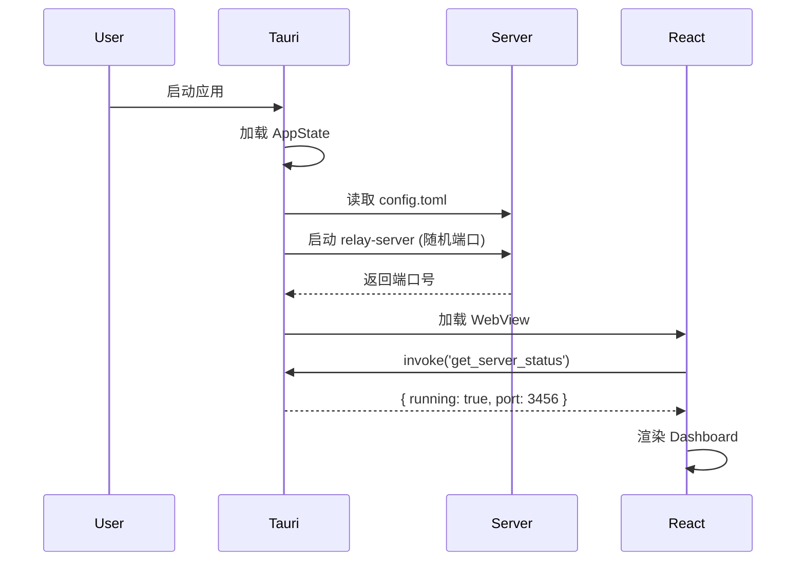
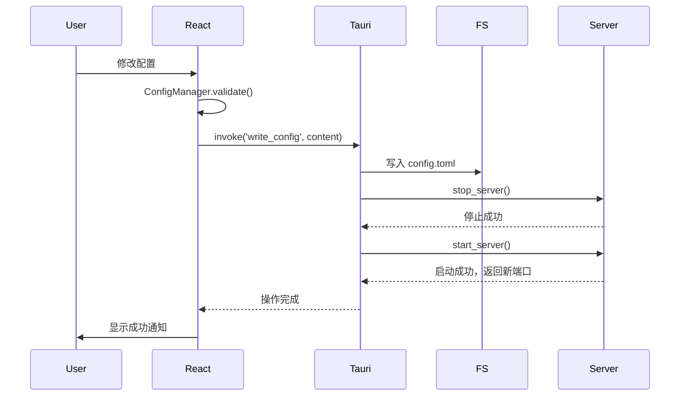
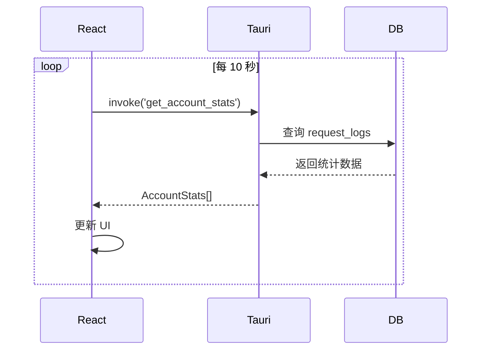

# Tauri 桌面应用设计文档

**日期**: 2025-12-04
**作者**: Claude + GWnbsp
**版本**: v0.1.0
**状态**: 设计阶段

## 目录

- [1. 项目概述](#1-项目概述)
- [2. 技术架构](#2-技术架构)
- [3. 功能模块设计](#3-功能模块设计)
- [4. Rust 后端实现](#4-rust-后端实现)
- [5. React 前端实现](#5-react-前端实现)
- [6. 数据流和状态管理](#6-数据流和状态管理)
- [7. 用户体验设计](#7-用户体验设计)
- [8. 构建和部署](#8-构建和部署)
- [9. 实施计划](#9-实施计划)

---

## 1. 项目概述

### 1.1 项目目标

将现有的 **claude-code-relay** CLI 工具扩展为具有图形界面的桌面应用，为非技术用户提供开箱即用的 AI API 中转服务管理工具。

### 1.2 核心原则

- **完全复用现有代码**：不重写业务逻辑，100% 复用 Rust crates
- **最小改动策略**：内嵌 HTTP 服务而非重构为 Tauri Commands
- **兼容现有配置**：直接读写 config.toml，与 CLI 工具共享配置
- **面向小白用户**：提供可视化配置、一键启停、实时监控
- **不影响 CLI 用户**：桌面应用作为可选功能，不破坏现有 CLI 功能

### 1.3 技术选型

| 层级 | 技术 | 理由 |
|-----|------|------|
| **桌面框架** | Tauri 2.x | Rust 生态原生支持，体积小（~5MB），性能优秀 |
| **前端框架** | React 18 + TypeScript | 生态成熟，类型安全 |
| **UI 组件库** | shadcn/ui | 现代化设计，基于 Radix UI，完全可定制 |
| **样式方案** | Tailwind CSS | 快速开发，一致性好 |
| **构建工具** | Vite | 快速热更新，开发体验好 |
| **后端复用** | 内嵌 relay-server | 最小改动，完全复用现有代码 |

---

## 2. 技术架构

### 2.1 整体架构图

```
┌─────────────────────────────────────────────────────────┐
│                   Tauri Desktop App                      │
├─────────────────────────────────────────────────────────┤
│                                                           │
│  ┌───────────────────────────────────────────────┐      │
│  │         React Frontend (WebView)              │      │
│  │  ┌─────────────┐  ┌──────────────────────┐   │      │
│  │  │  Dashboard  │  │  Accounts Management │   │      │
│  │  ├─────────────┤  ├──────────────────────┤   │      │
│  │  │  Settings   │  │  Logs Viewer         │   │      │
│  │  ├─────────────┤  ├──────────────────────┤   │      │
│  │  │  Chat Test  │  │  Stats & Monitor     │   │      │
│  │  └─────────────┘  └──────────────────────┘   │      │
│  └───────────────────────────────────────────────┘      │
│            ↕ Tauri Commands (IPC)                        │
│  ┌───────────────────────────────────────────────┐      │
│  │         Rust Backend (Tauri)                  │      │
│  │  ┌─────────────┐  ┌──────────────────────┐   │      │
│  │  │ Server Mgr  │  │  Config Manager      │   │      │
│  │  │ (start/stop)│  │  (read/write TOML)   │   │      │
│  │  ├─────────────┤  ├──────────────────────┤   │      │
│  │  │ Stats Query │  │  Account Tester      │   │      │
│  │  └─────────────┘  └──────────────────────┘   │      │
│  └───────────────────────────────────────────────┘      │
│            ↕ 启动并管理                                   │
│  ┌───────────────────────────────────────────────┐      │
│  │      Embedded relay-server (HTTP Server)      │      │
│  │         (复用现有 crates，随机端口)            │      │
│  └───────────────────────────────────────────────┘      │
│            ↕ HTTP API (localhost:random_port)            │
│  ┌───────────────────────────────────────────────┐      │
│  │        SQLite Database + Config Files         │      │
│  │   (sticky_sessions, request_logs, config.toml)│      │
│  └───────────────────────────────────────────────┘      │
│                                                           │
└─────────────────────────────────────────────────────────┘
        ↕ 外部客户端可通过 HTTP API 访问服务
```

### 2.2 数据流

#### 启动流程

1. **用户启动应用** → Tauri 主进程启动
2. **Tauri 加载配置** → 读取 config.toml
3. **启动内嵌服务** → 在随机端口启动 relay-server（异步线程）
4. **前端初始化** → React 应用加载，调用 `get_server_status` 获取端口
5. **显示 Dashboard** → 展示服务状态和账户信息

#### 配置更新流程

1. **用户修改配置** → 前端表单或代码编辑器
2. **验证配置** → 调用 `validate_config` Tauri Command
3. **保存配置** → 调用 `write_config` 写入 config.toml
4. **重启服务** → 自动调用 `stop_server` + `start_server`
5. **刷新界面** → 重新加载状态和账户列表

#### 监控数据流

1. **定时轮询** → 前端每 5-10 秒调用统计 Commands
2. **查询数据库** → Rust 侧查询 SQLite（会话、使用量）
3. **返回数据** → 序列化为 JSON 返回前端
4. **更新 UI** → React 组件更新表格和图表

### 2.3 目录结构

```
claude-code-relay/
├── crates/                    # 现有 Rust 代码（不改动）
│   ├── relay-core/
│   ├── relay-claude/
│   ├── relay-gemini/
│   ├── relay-codex/
│   ├── relay-openai-to-anthropic/
│   └── relay-server/
│
├── src-tauri/                 # 🆕 Tauri 后端
│   ├── src/
│   │   ├── main.rs           # Tauri 入口，应用生命周期管理
│   │   ├── server.rs         # ServerHandle，管理内嵌服务
│   │   └── commands.rs       # Tauri Commands 定义
│   ├── Cargo.toml
│   ├── tauri.conf.json
│   └── icons/
│
├── src/                       # 🆕 React 前端
│   ├── components/           # UI 组件
│   │   ├── ui/              # shadcn/ui 基础组件
│   │   ├── layout/          # 布局组件
│   │   ├── dashboard/       # 仪表盘组件
│   │   ├── accounts/        # 账户管理组件
│   │   └── settings/        # 设置组件
│   ├── pages/               # 页面路由
│   │   ├── Dashboard.tsx
│   │   ├── Accounts.tsx
│   │   ├── Settings.tsx
│   │   ├── Logs.tsx
│   │   └── Chat.tsx
│   ├── services/            # API 调用层
│   │   ├── api.ts
│   │   └── config.ts
│   ├── contexts/            # React Context
│   │   └── AppContext.tsx
│   ├── types/               # TypeScript 类型
│   │   └── index.ts
│   ├── App.tsx
│   └── main.tsx
│
├── docs/
│   └── plans/
│       └── 2025-12-04-tauri-desktop-design.md  # 本文档
│
├── package.json              # 前端依赖
├── tsconfig.json
├── vite.config.ts
├── tailwind.config.js
└── README.md                 # 需要更新
```

---

## 3. 功能模块设计

### 3.1 功能优先级

| 优先级 | 功能模块 | 描述 |
|-------|---------|------|
| **P0** | 服务控制 | 启动/停止服务，查看状态 |
| **P0** | 账户管理 | 添加/编辑/删除账户（可视化表单） |
| **P0** | 配置管理 | 可视化编辑 + 代码编辑 config.toml |
| **P1** | 实时监控 | 账户状态、请求统计、会话列表 |
| **P1** | 日志查看 | 实时日志流、过滤、搜索 |
| **P2** | 配置导入/导出 | 备份和恢复配置文件 |
| **P2** | 账户测试 | 测试账户连接性和可用性 |
| **P3** | AI 对话界面 | 内置对话窗口，测试服务 |

### 3.2 页面路由

| 路由 | 页面组件 | 功能描述 |
|-----|---------|---------|
| `/` | Dashboard | 服务状态卡片、账户概览、最近活动 |
| `/accounts` | Accounts | 账户列表表格、添加/编辑对话框、批量操作 |
| `/settings` | Settings | 服务器设置、API Keys、会话配置、应用偏好 |
| `/logs` | Logs | 实时日志列表、级别过滤、关键词搜索 |
| `/chat` | Chat | 简单的 AI 对话测试界面 |

### 3.3 Tauri Commands 列表

| Command | 参数 | 返回 | 描述 |
|---------|------|------|------|
| `start_server` | - | `u16` (port) | 启动内嵌服务，返回监听端口 |
| `stop_server` | - | `()` | 停止内嵌服务 |
| `get_server_status` | - | `ServerStatus` | 获取服务状态（运行中/端口） |
| `read_config` | - | `String` (TOML) | 读取配置文件内容 |
| `write_config` | `String` (TOML) | `()` | 写入配置并重启服务 |
| `validate_config` | `String` (TOML) | `ValidationResult` | 验证配置有效性 |
| `get_config_path` | - | `String` | 获取当前配置文件路径 |
| `set_config_path` | `String` (path) | `()` | 设置配置文件路径 |
| `get_account_stats` | - | `Vec<AccountStats>` | 获取所有账户统计信息 |
| `get_session_list` | - | `Vec<SessionInfo>` | 获取活动会话列表 |
| `test_account` | `String` (account_id) | `TestResult` | 测试账户连接 |

---

## 4. Rust 后端实现

### 4.1 Tauri 主程序

```rust
// src-tauri/src/main.rs
use tauri::Manager;
use std::sync::{Arc, Mutex};

struct AppState {
    server_handle: Arc<Mutex<Option<ServerHandle>>>,
    server_port: Arc<Mutex<Option<u16>>>,
    config_path: Arc<Mutex<String>>,
}

fn main() {
    tauri::Builder::default()
        .setup(|app| {
            // 初始化应用状态
            let config_path = get_default_config_path(app);
            app.manage(AppState {
                server_handle: Arc::new(Mutex::new(None)),
                server_port: Arc::new(Mutex::new(None)),
                config_path: Arc::new(Mutex::new(config_path)),
            });

            // 自动启动服务
            if let Err(e) = auto_start_server(app) {
                eprintln!("Failed to auto-start server: {}", e);
            }

            Ok(())
        })
        .invoke_handler(tauri::generate_handler![
            start_server,
            stop_server,
            get_server_status,
            get_config_path,
            set_config_path,
            read_config,
            write_config,
            validate_config,
            get_account_stats,
            get_session_list,
            test_account,
        ])
        .run(tauri::generate_context!())
        .expect("error while running tauri application");
}
```

### 4.2 服务管理模块

```rust
// src-tauri/src/server.rs
use relay_server::{Config, run_server};
use tokio::task::JoinHandle;
use std::net::TcpListener;

pub struct ServerHandle {
    handle: JoinHandle<()>,
    port: u16,
}

impl ServerHandle {
    pub async fn start(config_path: &str) -> Result<Self, String> {
        // 读取配置
        let config = Config::from_file(config_path)
            .map_err(|e| format!("Failed to load config: {}", e))?;

        // 查找可用端口
        let port = find_available_port()
            .ok_or("No available port found")?;

        // 启动异步服务
        let handle = tokio::spawn(async move {
            if let Err(e) = run_server(config, port).await {
                eprintln!("Server error: {}", e);
            }
        });

        Ok(ServerHandle { handle, port })
    }

    pub async fn stop(self) {
        self.handle.abort();
    }

    pub fn port(&self) -> u16 {
        self.port
    }
}

fn find_available_port() -> Option<u16> {
    (3000..4000).find(|port| {
        TcpListener::bind(("127.0.0.1", *port)).is_ok()
    })
}
```

### 4.3 配置管理 Commands

```rust
// src-tauri/src/commands.rs
use tauri::State;

#[tauri::command]
async fn start_server(state: State<'_, AppState>) -> Result<u16, String> {
    let config_path = state.config_path.lock().unwrap().clone();

    let handle = ServerHandle::start(&config_path).await?;
    let port = handle.port();

    *state.server_port.lock().unwrap() = Some(port);
    *state.server_handle.lock().unwrap() = Some(handle);

    Ok(port)
}

#[tauri::command]
async fn stop_server(state: State<'_, AppState>) -> Result<(), String> {
    if let Some(handle) = state.server_handle.lock().unwrap().take() {
        handle.stop().await;
    }
    *state.server_port.lock().unwrap() = None;
    Ok(())
}

#[tauri::command]
async fn read_config(state: State<'_, AppState>) -> Result<String, String> {
    let path = state.config_path.lock().unwrap().clone();
    std::fs::read_to_string(path)
        .map_err(|e| format!("Failed to read config: {}", e))
}

#[tauri::command]
async fn write_config(
    content: String,
    state: State<'_, AppState>
) -> Result<(), String> {
    let path = state.config_path.lock().unwrap().clone();

    // 写入配置文件
    std::fs::write(path, content)
        .map_err(|e| format!("Failed to write config: {}", e))?;

    // 重启服务应用新配置
    stop_server(state.clone()).await?;
    start_server(state).await?;

    Ok(())
}
```

### 4.4 统计查询 Commands

```rust
// src-tauri/src/commands.rs (续)

#[derive(Debug, Serialize)]
pub struct AccountStats {
    account_id: String,
    account_name: String,
    platform: String,
    total_requests: i64,
    last_used: Option<String>,
    is_available: bool,
}

#[tauri::command]
async fn get_account_stats(state: State<'_, AppState>) -> Result<Vec<AccountStats>, String> {
    let config_path = state.config_path.lock().unwrap().clone();
    let config = Config::from_file(&config_path)
        .map_err(|e| format!("Failed to load config: {}", e))?;

    let db_path = &config.server.database_path;
    let pool = db::init_db(db_path).await
        .map_err(|e| format!("Failed to connect to database: {}", e))?;

    let mut stats = Vec::new();
    for account in &config.accounts {
        let usage = db::get_account_usage(&pool, &account.id).await
            .map_err(|e| format!("Failed to get usage: {}", e))?;

        stats.push(AccountStats {
            account_id: account.id.clone(),
            account_name: account.name.clone(),
            platform: account.platform().to_string(),
            total_requests: usage.total_requests,
            last_used: usage.last_used,
            is_available: account.is_available(),
        });
    }

    Ok(stats)
}

#[tauri::command]
async fn test_account(
    account_id: String,
    state: State<'_, AppState>
) -> Result<TestResult, String> {
    let config_path = state.config_path.lock().unwrap().clone();
    let config = Config::from_file(&config_path)
        .map_err(|e| format!("Failed to load config: {}", e))?;

    let account = config.accounts.iter()
        .find(|a| a.id == account_id)
        .ok_or_else(|| format!("Account {} not found", account_id))?;

    match account.get_credentials().await {
        Ok(_) => {
            Ok(TestResult {
                success: true,
                message: "账户连接成功".to_string(),
                details: Some(format!("Platform: {}", account.platform())),
            })
        }
        Err(e) => {
            Ok(TestResult {
                success: false,
                message: format!("连接失败: {}", e),
                details: None,
            })
        }
    }
}
```

### 4.5 数据库扩展

```rust
// crates/relay-server/src/db.rs (新增函数)

#[derive(Debug)]
pub struct AccountUsage {
    pub total_requests: i64,
    pub last_used: Option<String>,
}

pub async fn get_account_usage(
    pool: &Pool<Sqlite>,
    account_id: &str,
) -> Result<AccountUsage, sqlx::Error> {
    let result = sqlx::query!(
        r#"
        SELECT
            COUNT(*) as total_requests,
            MAX(created_at) as last_used
        FROM request_logs
        WHERE account_id = ?
        "#,
        account_id
    )
    .fetch_one(pool)
    .await?;

    Ok(AccountUsage {
        total_requests: result.total_requests,
        last_used: result.last_used,
    })
}

#[derive(Debug, Serialize)]
pub struct SessionInfo {
    pub session_hash: String,
    pub account_id: String,
    pub expires_at: String,
}

pub async fn get_active_sessions(
    pool: &Pool<Sqlite>,
) -> Result<Vec<SessionInfo>, sqlx::Error> {
    sqlx::query_as!(
        SessionInfo,
        r#"
        SELECT session_hash, account_id, expires_at
        FROM sticky_sessions
        WHERE expires_at > datetime('now')
        ORDER BY expires_at DESC
        "#
    )
    .fetch_all(pool)
    .await
}
```

---

## 5. React 前端实现

### 5.1 技术栈

- **React 18.2** - UI 框架
- **TypeScript 5.3** - 类型安全
- **React Router 6** - 路由管理
- **Tailwind CSS 3.4** - 样式方案
- **shadcn/ui** - UI 组件库
- **Lucide React** - 图标库
- **@tauri-apps/api** - Tauri API 绑定
- **@iarna/toml** - TOML 解析和序列化
- **date-fns** - 日期格式化
- **sonner** - Toast 通知

### 5.2 API 服务层

```typescript
// src/services/api.ts
import { invoke } from '@tauri-apps/api/tauri';

export interface ServerStatus {
  running: boolean;
  port?: number;
}

export interface AccountStats {
  account_id: string;
  account_name: string;
  platform: string;
  total_requests: number;
  last_used?: string;
  is_available: boolean;
}

export interface SessionInfo {
  session_hash: string;
  account_id: string;
  expires_at: string;
}

export interface TestResult {
  success: boolean;
  message: string;
  details?: string;
}

export class TauriAPI {
  static async startServer(): Promise<number> {
    return invoke<number>('start_server');
  }

  static async stopServer(): Promise<void> {
    return invoke('stop_server');
  }

  static async getServerStatus(): Promise<ServerStatus> {
    return invoke('get_server_status');
  }

  static async readConfig(): Promise<string> {
    return invoke('read_config');
  }

  static async writeConfig(content: string): Promise<void> {
    return invoke('write_config', { content });
  }

  static async getAccountStats(): Promise<AccountStats[]> {
    return invoke('get_account_stats');
  }

  static async getSessionList(): Promise<SessionInfo[]> {
    return invoke('get_session_list');
  }

  static async testAccount(accountId: string): Promise<TestResult> {
    return invoke('test_account', { accountId });
  }
}
```

### 5.3 配置管理

```typescript
// src/services/config.ts
import TOML from '@iarna/toml';

export interface Config {
  server: {
    host: string;
    port: number;
    database_path: string;
    log_level: string;
    api_keys: string[];
  };
  session: {
    sticky_ttl_seconds: number;
    renewal_threshold_seconds: number;
  };
  accounts: Account[];
}

export interface Account {
  type: 'claude-oauth' | 'claude-api' | 'gemini' | 'openai-responses';
  id: string;
  name: string;
  priority: number;
  enabled: boolean;
  // 动态字段根据 type 不同
  refresh_token?: string;
  api_key?: string;
  api_url?: string;
  proxy?: ProxyConfig;
}

export class ConfigManager {
  static parse(content: string): Config {
    return TOML.parse(content) as Config;
  }

  static stringify(config: Config): string {
    return TOML.stringify(config);
  }

  static validate(config: Config): { valid: boolean; errors: string[] } {
    const errors: string[] = [];

    // 验证逻辑...

    return { valid: errors.length === 0, errors };
  }

  static addAccount(config: Config, account: Account): Config {
    return {
      ...config,
      accounts: [...config.accounts, account],
    };
  }

  static updateAccount(config: Config, accountId: string, updates: Partial<Account>): Config {
    return {
      ...config,
      accounts: config.accounts.map(acc =>
        acc.id === accountId ? { ...acc, ...updates } : acc
      ),
    };
  }

  static removeAccount(config: Config, accountId: string): Config {
    return {
      ...config,
      accounts: config.accounts.filter(acc => acc.id !== accountId),
    };
  }
}
```

### 5.4 全局状态管理

```typescript
// src/contexts/AppContext.tsx
import { createContext, useContext, useState, useEffect } from 'react';
import { TauriAPI } from '@/services/api';

interface AppState {
  serverStatus: ServerStatus | null;
  config: Config | null;
  loading: boolean;
}

interface AppContextType {
  state: AppState;
  actions: {
    startServer: () => Promise<void>;
    stopServer: () => Promise<void>;
    refreshStatus: () => Promise<void>;
    updateConfig: (config: Config) => Promise<void>;
  };
}

const AppContext = createContext<AppContextType | null>(null);

export function AppProvider({ children }: { children: React.ReactNode }) {
  const [state, setState] = useState<AppState>({
    serverStatus: null,
    config: null,
    loading: true,
  });

  // 自动轮询服务状态
  useEffect(() => {
    refreshStatus();
    const interval = setInterval(refreshStatus, 5000);
    return () => clearInterval(interval);
  }, []);

  const refreshStatus = async () => {
    try {
      const status = await TauriAPI.getServerStatus();
      setState(s => ({ ...s, serverStatus: status }));
    } catch (error) {
      console.error('Failed to get server status:', error);
    }
  };

  const startServer = async () => {
    const port = await TauriAPI.startServer();
    setState(s => ({
      ...s,
      serverStatus: { running: true, port }
    }));
  };

  const stopServer = async () => {
    await TauriAPI.stopServer();
    setState(s => ({
      ...s,
      serverStatus: { running: false }
    }));
  };

  const updateConfig = async (config: Config) => {
    const content = ConfigManager.stringify(config);
    await TauriAPI.writeConfig(content);
    setState(s => ({ ...s, config }));
  };

  return (
    <AppContext.Provider value={{
      state,
      actions: { startServer, stopServer, refreshStatus, updateConfig },
    }}>
      {children}
    </AppContext.Provider>
  );
}

export const useApp = () => {
  const context = useContext(AppContext);
  if (!context) throw new Error('useApp must be used within AppProvider');
  return context;
};
```

### 5.5 核心页面组件

#### Dashboard（仪表盘）

```typescript
// src/pages/Dashboard.tsx
export default function Dashboard() {
  const { state, actions } = useApp();
  const [stats, setStats] = useState<AccountStats[]>([]);

  useEffect(() => {
    loadStats();
    const interval = setInterval(loadStats, 10000);
    return () => clearInterval(interval);
  }, []);

  const loadStats = async () => {
    const data = await TauriAPI.getAccountStats();
    setStats(data);
  };

  return (
    <div className="space-y-6">
      {/* 服务状态卡片 */}
      <Card>
        <CardHeader>
          <CardTitle className="flex items-center justify-between">
            <span>服务状态</span>
            <Badge variant={state.serverStatus?.running ? "success" : "secondary"}>
              {state.serverStatus?.running ? "运行中" : "已停止"}
            </Badge>
          </CardTitle>
        </CardHeader>
        <CardContent>
          <div className="flex gap-4">
            <Button onClick={actions.startServer} disabled={state.serverStatus?.running}>
              启动服务
            </Button>
            <Button onClick={actions.stopServer} variant="destructive" disabled={!state.serverStatus?.running}>
              停止服务
            </Button>
          </div>
        </CardContent>
      </Card>

      {/* 账户统计 */}
      <AccountStatsTable stats={stats} />

      {/* 活动会话 */}
      <ActiveSessions />
    </div>
  );
}
```

#### Accounts（账户管理）

```typescript
// src/pages/Accounts.tsx
export default function Accounts() {
  const [accounts, setAccounts] = useState<Account[]>([]);
  const [dialogOpen, setDialogOpen] = useState(false);

  const handleAddAccount = async (account: Account) => {
    const config = await loadConfig();
    const newConfig = ConfigManager.addAccount(config, account);
    await updateConfig(newConfig);
    setAccounts(newConfig.accounts);
  };

  return (
    <div className="space-y-4">
      <div className="flex justify-between">
        <h1 className="text-3xl font-bold">账户管理</h1>
        <Button onClick={() => setDialogOpen(true)}>
          <Plus className="mr-2 h-4 w-4" />
          添加账户
        </Button>
      </div>

      <DataTable columns={columns} data={accounts} />

      <AccountDialog
        open={dialogOpen}
        onClose={() => setDialogOpen(false)}
        onSave={handleAddAccount}
      />
    </div>
  );
}
```

---

## 6. 数据流和状态管理

### 6.1 启动流程



### 6.2 配置更新流程



### 6.3 统计数据轮询



---

## 7. 用户体验设计

### 7.1 应用行为

| 场景 | 行为 | 配置 |
|-----|------|------|
| 首次启动 | 自动创建默认配置，引导用户添加账户 | settings.first_run |
| 正常启动 | 自动启动服务，显示 Dashboard | auto_start_server |
| 关闭窗口 | 最小化到托盘（可配置） | minimize_to_tray |
| 系统启动 | 自动运行（可配置） | auto_launch |
| 服务崩溃 | 显示通知，提供重启按钮 | - |
| 配置错误 | 显示错误详情，保持上次有效配置 | - |

### 7.2 系统托盘功能

```
┌─────────────────────────┐
│ Claude Code Relay       │ ← 托盘图标
├─────────────────────────┤
│ ● 服务运行中 (3456)     │
│                         │
│ 打开主窗口              │
│ 启动服务 / 停止服务     │
│ ───────────────────     │
│ 设置                    │
│ 退出                    │
└─────────────────────────┘
```

### 7.3 通知系统

| 事件 | 通知内容 |
|-----|---------|
| 服务启动成功 | "服务已启动，监听端口 3456" |
| 服务停止 | "服务已停止" |
| 配置保存成功 | "配置已保存并应用" |
| 账户测试成功 | "账户 claude-1 连接成功" |
| 账户测试失败 | "账户 claude-1 连接失败: xxx" |
| 错误发生 | "错误: xxx" |

---

## 8. 构建和部署

### 8.1 开发环境设置

```bash
# 1. 安装前端依赖
npm install

# 2. 安装 Tauri CLI
cargo install tauri-cli

# 3. 开发模式运行
npm run tauri:dev
```

### 8.2 构建脚本

```bash
# scripts/build-desktop.sh
#!/bin/bash

echo "Building Claude Code Relay Desktop..."

# 构建前端
npm run build

# 构建 Tauri 应用
npm run tauri build

# 输出位置
# macOS: src-tauri/target/release/bundle/dmg/
# Windows: src-tauri/target/release/bundle/msi/
# Linux: src-tauri/target/release/bundle/appimage/
```

### 8.3 发布配置

在 `.github/workflows/release-desktop.yml` 中添加桌面版构建：

```yaml
name: Release Desktop App

on:
  push:
    tags:
      - 'desktop-v*'

jobs:
  build:
    strategy:
      matrix:
        platform: [macos-latest, ubuntu-latest, windows-latest]

    runs-on: ${{ matrix.platform }}

    steps:
      - uses: actions/checkout@v3

      - name: Setup Node
        uses: actions/setup-node@v3
        with:
          node-version: 18

      - name: Install Rust
        uses: actions-rs/toolchain@v1
        with:
          toolchain: stable

      - name: Install dependencies
        run: npm install

      - name: Build Tauri app
        run: npm run tauri build

      - name: Upload artifacts
        uses: actions/upload-artifact@v3
        with:
          name: ${{ matrix.platform }}-bundle
          path: src-tauri/target/release/bundle/
```

---

## 9. 实施计划

### 9.1 里程碑

#### 阶段 1：基础架构（1-2 周）

- [ ] 初始化 Tauri 项目结构
- [ ] 配置 React + TypeScript + Vite
- [ ] 实现基础 Tauri Commands（start/stop/config）
- [ ] 实现服务管理模块（ServerHandle）
- [ ] 创建基础 Layout 和路由

#### 阶段 2：核心功能（2-3 周）

- [ ] Dashboard 页面（服务状态、基础统计）
- [ ] Accounts 页面（列表、添加/编辑对话框）
- [ ] Settings 页面（可视化编辑 + 代码编辑）
- [ ] 配置 TOML 解析和验证
- [ ] 数据库统计查询功能

#### 阶段 3：增强功能（1-2 周）

- [ ] 实时日志查看（Logs 页面）
- [ ] 账户测试功能
- [ ] 配置导入/导出
- [ ] 系统托盘集成
- [ ] 通知系统

#### 阶段 4：可选功能（1 周）

- [ ] AI 对话测试界面
- [ ] 更详细的统计图表
- [ ] 应用偏好设置（主题、语言）
- [ ] 开机自启动

#### 阶段 5：测试和优化（1 周）

- [ ] 功能测试
- [ ] 性能优化
- [ ] UI/UX 优化
- [ ] 文档完善
- [ ] 准备 PR

### 9.2 开发检查清单

**Rust 后端**
- [ ] ServerHandle 实现（启动/停止/端口查找）
- [ ] 所有 Tauri Commands 实现
- [ ] 数据库查询函数扩展
- [ ] 错误处理和日志
- [ ] 单元测试

**React 前端**
- [ ] API 服务层（TauriAPI）
- [ ] 配置管理（ConfigManager）
- [ ] 全局状态（AppContext）
- [ ] 所有页面组件
- [ ] UI 组件库集成
- [ ] 响应式设计

**集成测试**
- [ ] 启动/停止服务流程
- [ ] 配置读写和验证
- [ ] 账户管理操作
- [ ] 统计数据查询
- [ ] 跨平台兼容性（macOS、Windows）

**文档**
- [ ] README 更新（添加桌面版说明）
- [ ] 用户手册
- [ ] 开发者指南
- [ ] CHANGELOG 更新

---

## 10. 注意事项和风险

### 10.1 技术风险

| 风险 | 影响 | 缓解措施 |
|-----|------|---------|
| 端口冲突 | 服务无法启动 | 实现端口扫描，自动选择可用端口 |
| 配置文件损坏 | 应用无法启动 | 保留上次有效配置，提供配置修复工具 |
| 数据库锁定 | 统计查询失败 | 使用只读连接，设置合理超时 |
| 跨平台兼容性 | 某些平台功能异常 | 早期多平台测试 |

### 10.2 PR 准备事项

- [ ] 确保所有新功能在独立目录（`src-tauri/`, `src/`）
- [ ] 不修改现有 CLI 代码（`crates/` 目录）
- [ ] 更新 README.md，添加"Desktop App"章节
- [ ] 提供构建和运行指南
- [ ] 确保 CLI 用户不受影响（可选功能）
- [ ] 准备 Demo 截图和视频
- [ ] 编写详细的 PR 描述

---

## 附录

### A. 技术选型对比

| 方案 | 优势 | 劣势 | 结论 |
|-----|------|------|------|
| **Tauri** | Rust 原生、体积小、性能好 | 生态较新 | ✅ 选用 |
| **Electron** | 生态成熟 | 体积大（100MB+） | ❌ 不选 |
| **Flutter** | 跨平台好 | 需要 FFI 桥接 | ❌ 不选 |

### B. 依赖列表

**Rust 依赖**
- `tauri = "1.6"`
- `serde = "1.0"`
- `tokio = "1.0"`

**前端依赖**
- `react = "^18.2.0"`
- `@tauri-apps/api = "^1.5.3"`
- `tailwindcss = "^3.4.1"`
- `@iarna/toml = "^2.2.5"`

### C. 参考资源

- [Tauri 官方文档](https://tauri.app/)
- [shadcn/ui 文档](https://ui.shadcn.com/)
- [React Router 文档](https://reactrouter.com/)

---

**文档版本**: v1.0
**最后更新**: 2025-12-04
**审阅状态**: 待审阅
